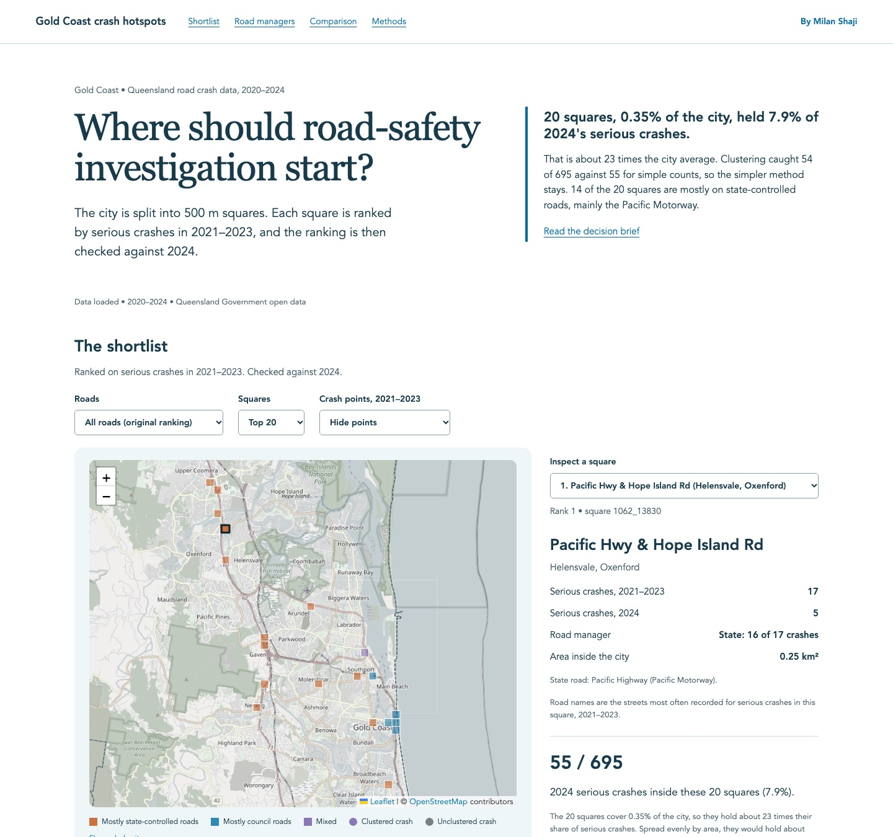

# Gold Coast transport evidence

[Open the live dashboard](https://milanshaji.com/gold-coast-transport-evidence/) · [Read the decision brief](https://milanshaji.com/gold-coast-transport-evidence/decision-brief.html) · [Download the frozen inputs](https://github.com/milanshaji1/gold-coast-transport-evidence/releases/tag/v1.0.0)



An independent road-safety investigation shortlist built from Queensland Government open data. The practical question is **where further investigation should begin**, rather than which engineering treatment should be installed.

**Decision:** retain the transparent count baseline. At the primary 20-cell budget, the count shortlist captured **55/695 serious crashes (7.91%) in held-out 2024**, compared with **54/695 (7.77%)** for density-filtered counts. The small difference does not establish statistical superiority. Most serious crashes occurred outside either shortlist.

[Decision brief](docs/decision-brief.md) · [Methods](docs/methods.md) · [Results](evidence/results.json) · [Sources](docs/sources.md) · [AI evidence](docs/ai-evidence.md) · [Platform status](docs/platforms.md) · [Review fixes and historical limits](docs/review-resolution.md)

## What is implemented

- Frozen official source bytes, manifest-only ingestion, exact curated-data verification, typed Parquet and a DuckDB relational warehouse.
- GDA2020 → MGA zone 56 projection, fixed 500 m grid, deterministic count and DBSCAN comparisons, validation before temporal holdout.
- Gamma-Poisson uncertainty experiment with an explicit rejection decision for site-specific interpretation.
- Local dashboard with a count shortlist, labelled training-period cluster points, accessible tables and shared exports. Desktop/mobile and focused keyboard/download checks are recorded in [browser QA](docs/browser-qa.md).
- Four read-only tools, a real MCP client/server exchange and a small lexical retrieval baseline. The recorded tool-contract evaluation passed **29/30**, with one retrieval failure and a documented scorer correction.

**Verified platform work:** a saved Power BI descriptive report with real monthly data, typed metrics and tested year/severity filters; three BigQuery sandbox batch tables, exact monthly reconciliation and an actual spatial join reproducing the 55/695 shortlist result. [Execution record and account links](docs/platforms.md).

**Scope:** Live LLM workflow/evaluation remains explicitly deferred, and Milan’s personal contribution walkthrough remains unrecorded. The native select arrow-key automation path is unverified; the accessible keyboard table path works. The public dashboard uses frozen data and requires no login. See [publication notes](docs/publication.md) for the public-copy boundary.

## Reproduce

Python 3.12+ and Node.js 24+ are used. Commands run from this directory:

```sh
python3 -m venv .venv
.venv/bin/python -m pip install -r requirements.lock
.venv/bin/python -m pytest -q
node --test site/metrics.test.js
```

The full input snapshot is kept outside Git. The versioned release archive contains the exact input bytes under CC BY 4.0, along with provenance and attributions. Download `transport-inputs-8c293a52745057c4.tar.gz` from the release above, verify its SHA-256 against `evidence/release.json`, and extract it into this repository before the frozen rebuild:

```sh
tar -xzf transport-inputs-8c293a52745057c4.tar.gz
PYTHONPATH=src .venv/bin/python -m transport.acquire "$(cat evidence/snapshot-path.txt)"
PYTHONPATH=src .venv/bin/python -m transport.pipeline freeze
PYTHONPATH=src .venv/bin/python -m transport.pipeline evaluate
PYTHONPATH=src .venv/bin/python -m transport.map_layers
PYTHONPATH=src .venv/bin/python -m transport.exports
.venv/bin/python -m http.server 8765 --bind 127.0.0.1 --directory site
```

Open `http://127.0.0.1:8765`. There are no cloud credentials or live model endpoints in the dashboard. It is an independent web demo, not an embedded Power BI report.

A fresh upstream acquisition is `PYTHONPATH=src .venv/bin/python -m transport.acquire` without an argument. It creates a new timestamped snapshot. It must be treated as a new release: existing freeze/result checks intentionally reject changed inputs rather than silently replacing the evaluation.

The post-review integrity guard protects the current implementation and source derivation. It is an explicitly dated amendment added after the original holdout, not retroactive proof of an earlier code freeze. The original download was single-pass; future acquisition uses two matching passes with stable version metadata. See the review-resolution record for these limits.

Real MCP demonstration:

```sh
PYTHONPATH=src .venv/bin/python -m transport.client
```

The development tests use compact, hand-checked fixtures. The full-data reconciliation test runs only when the frozen Parquet is present. CI does not download changing external datasets. Final evaluation transcripts are retained; rerunning a known test set is a regression check, not a new held-out reliability estimate.

## Interpretation limits

Serious crashes are Fatal/Hospitalisation **events**. Serious casualties are fatal plus hospitalised **people**. Counts do not measure risk per trip, causal effects or prevented crashes. No traffic exposure or engineering assessment is available. Current boundary, police reporting, source revisions and pandemic-related travel changes affect interpretation.

The source has 8,142 casualty crashes in 2020–2024; the complete exact-LGA historical snapshot has 45,266 rows. These denominators are intentionally different. Two serious crashes lie outside the current boundary but remain in source-LGA totals.

## Provenance and contribution

Data © State of Queensland, Creative Commons Attribution 4.0; source links and exact hashes are in the manifest. This project is independent and is not endorsed by the City or TMR. See [contribution record](docs/contributions.md) for AI assistance and the walkthrough still needed before making personal implementation claims.
