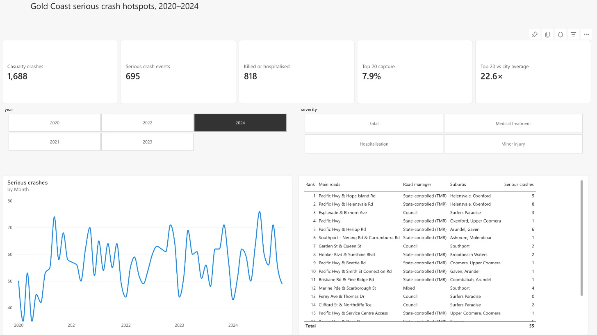
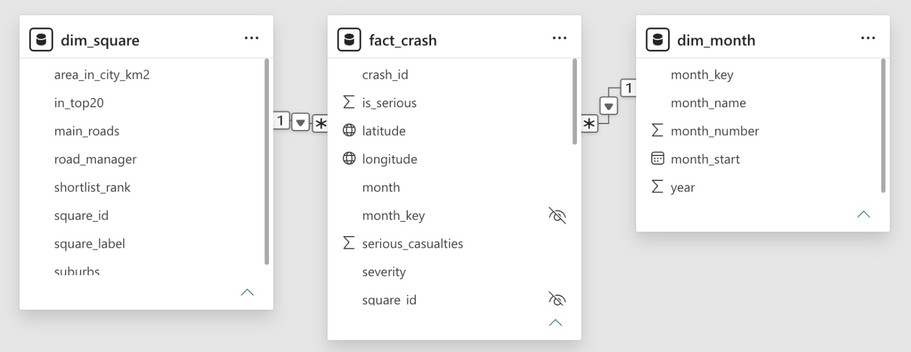

# Power BI and BigQuery

## Power BI



A one-page report built in the Power BI service in October 2026. It loads its data straight from this repository, so it can be refreshed without any private files.

- **Data:** Power Query reads three published CSVs: `exports/cloud/events.csv` (8,142 crashes), `exports/cloud/cells.csv` (5,774 grid squares) and `site/data/shortlist.csv` (the ranked squares with their main roads, road manager and suburbs).
- **Model:** a star schema. The `fact_crash` table joins many-to-one to `dim_month` and `dim_square`, and the fact table's keys are hidden.
- **Measures:** ten DAX measures, plus four that only format the card labels.
- **Page:** year and severity filters, five cards, a monthly trend of serious crashes and the top 20 table. The trend ignores the year filter so all five years stay visible.



The main measures:

```dax
Serious crashes = SUM(fact_crash[is_serious])
Serious crashes in top 20 = CALCULATE([Serious crashes], dim_square[in_top20] = "Yes")
Top 20 capture = DIVIDE([Serious crashes in top 20], [Serious crashes])
Top 20 area share =
    DIVIDE(
        CALCULATE(SUM(dim_square[area_in_city_km2]), dim_square[in_top20] = "Yes"),
        CALCULATE(SUM(dim_square[area_in_city_km2]), REMOVEFILTERS(dim_square))
    )
Times city average = DIVIDE([Top 20 capture], [Top 20 area share])
```

`in_top20` is a Yes/No column rather than a test on the rank, because DAX treats a blank rank as 0, so `rank <= 20` would also pick up every unranked square.

The full model, with every measure and the Power Query steps, is in [`powerbi/model.tmdl`](../powerbi/model.tmdl). TMDL is Power BI's text format for a model. This copy was scripted from the live model, with Power BI's automatic date tables and internal IDs removed.

**Numbers check.** The report matches the Python results. All years: 8,142 casualty crashes, 3,407 serious crashes and 4,079 people killed or hospitalised. 2024: 1,688 / 695 / 818, with 55 of the 695 serious crashes (7.9%) in the top 20 squares, 22.6 times their share of the city's area.

The first version, on 5 October, was a single pasted table of monthly totals with no relationships or measures. This report replaced it.

## BigQuery

Run and checked on 5 October 2026 against data snapshot `8c293a52745057c4`. Three sandbox tables held 223 monthly rows, 8,142 events and 5,774 cells in the Sydney region. The executed spatial join matched every event to exactly one cell with zero assignment mismatches. Monthly reaggregation also had zero mismatches, and SQL reproduced the top-20 result of 55 / 695 serious events in 2024.

[Public execution record](../evidence/platforms/platform-verification.json) · [SQL with account ID replaced](../sql/bigquery-verified.sql) · [CSV and schema reload pack](../exports/cloud/README.md)

The sandbox's observed expiry was 60 days. Preserved CSVs and SQL support reload into an authorised project. Geographic WKT approximates the transformed full grid; every snapshot point agreed with the local metre-based assignment.

## What's public

The execution record leaves out account and job IDs but keeps the counts and query timings. It also covers the first Power BI version. The Power BI screenshots show only the report and the model. The live report needs a Power BI account, but the dashboard and every analysis result can be checked without one.
